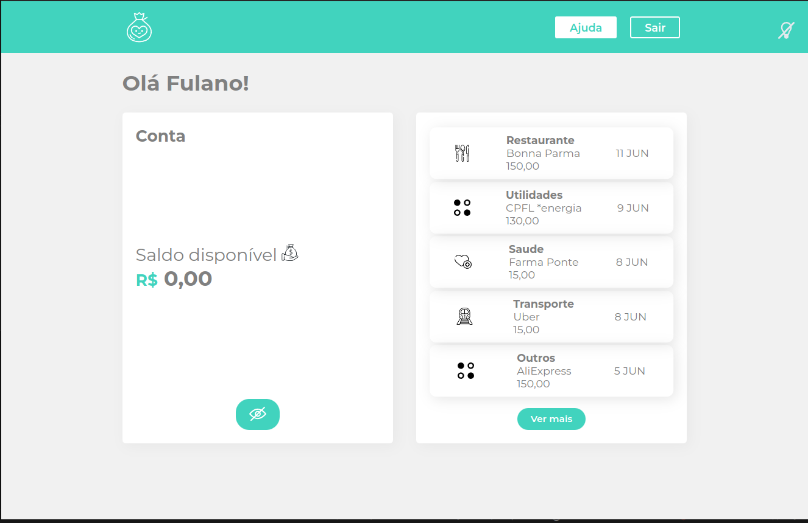
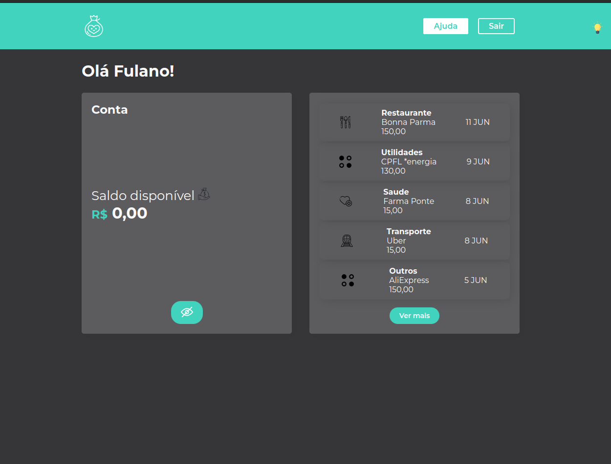

# Aprendendo styled components

Neste projeto eu aprendi como trabalhar com styled components
e construir um Light Mode e Dark Mode

## Layout construído com Styled Components:

### - Light Mode

### - Dark Mode
